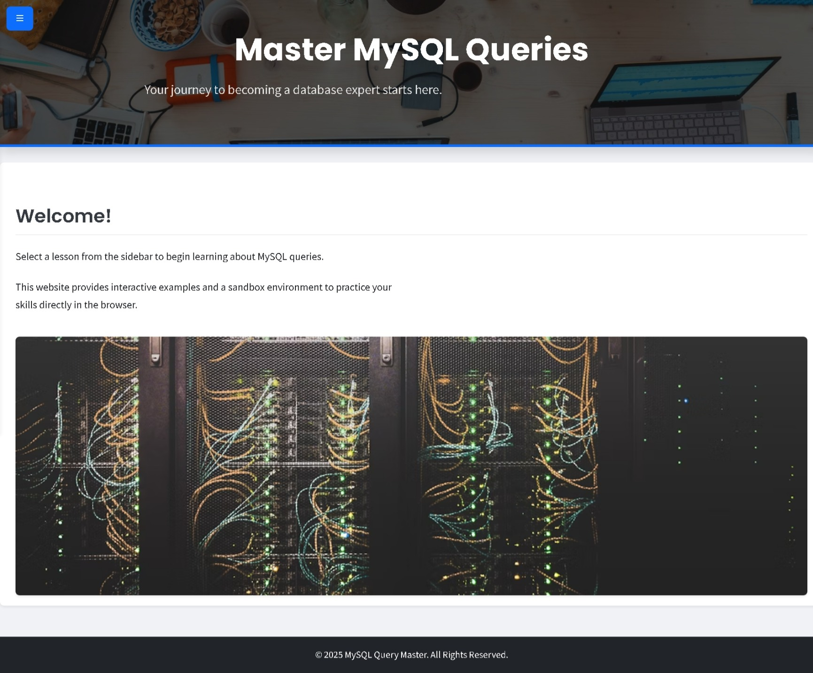
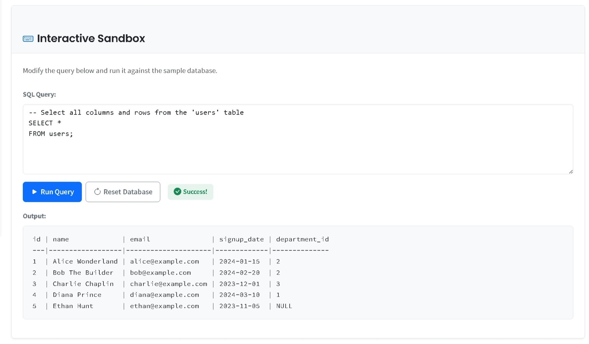
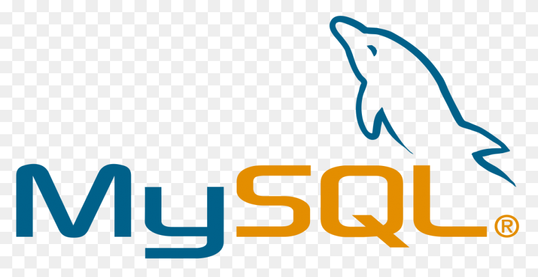

# Master MySQL Queries 🚀


An interactive web-based course designed to help you master MySQL queries from beginner to advanced concepts. Practice SQL directly in your browser with our integrated SQL sandbox - no database setup required!

## ✨ Features

- **Interactive SQL Sandbox**: Execute and test SQL queries directly in your browser
- **Progressive Learning Path**: Structured lessons from basic to advanced concepts
- **Real-time Feedback**: Get immediate results from your queries
- **Responsive Design**: Learn on any device
- **In-browser Database**: Powered by sql.js, no server setup required
- **Syntax Highlighting**: Clear code visualization with Prism.js

## 📚 Course Content

The course is organized into four comprehensive modules:

### Module 1: Querying Data
- **1.1 Introduction to SELECT**: Learn the foundations of retrieving data
- **1.2 Filtering with WHERE**: Filter results based on conditions
- **1.3 Sorting with ORDER BY**: Organize your query results
- **1.4 Limiting Results with LIMIT**: Control the number of returned rows

### Module 2: Manipulating Data
- **2.1 Inserting Data (INSERT)**: Add new records to your tables
- **2.2 Updating Data (UPDATE)**: Modify existing data
- **2.3 Deleting Data (DELETE)**: Remove unwanted records

### Module 3: Joining Tables
- **3.1 Combining Tables (INNER JOIN)**: Connect related data across tables
- **3.2 Other Join Types**: Coming soon!

### Module 4: Aggregation
- **4.1 Aggregate Functions (COUNT, AVG, SUM, MIN, MAX)**: Calculate summary statistics
- **4.2 Grouping Results (GROUP BY)**: Group data for analysis

## 🛠️ Technologies Used

- **Frontend**: HTML5, CSS3, JavaScript
- **CSS Framework**: Bootstrap 5
- **SQL Engine**: [sql.js](https://github.com/sql-js/sql.js/) (SQLite compiled to WebAssembly)
- **Syntax Highlighting**: Prism.js
- **Icons**: Bootstrap Icons

## 📋 Prerequisites

- A modern web browser (Chrome, Firefox, Safari, or Edge)
- No database installation required!

## 🚀 Getting Started

1. Clone the repository:
   ```bash
   git clone https://github.com/Om-Gajjar/mysql-query-master.git
   ```

2. Navigate to the project directory:
   ```bash
   cd mysql-query-master
   ```

3. Open index.html in your browser or use a local development server:
   ```bash
   # Using Python 3
   python -m http.server
   
   # Using Node.js with http-server
   npx http-server
   ```

4. Start learning by clicking on lessons in the sidebar!

## 📸 Screenshots


*Homepage with course navigation and lesson selection*


*Interactive SQL Sandbox with real-time query execution*

## 🧠 How the SQL Sandbox Works

The project uses sql.js, a JavaScript SQL database engine that:
- Creates an in-memory SQLite database in your browser
- Pre-loads sample tables (`users` and `departments`)
- Executes your queries directly in the browser
- Provides real-time feedback on your query results
- Can be reset to restore the original database state

## 🤝 Contributing

Contributions are welcome! Here's how you can contribute:

1. Fork the repository
2. Create your feature branch (`git checkout -b feature/amazing-lesson`)
3. Commit your changes (`git commit -m 'Add some amazing lesson'`)
4. Push to the branch (`git push origin feature/amazing-lesson`)
5. Open a Pull Request

## 🛠️ Development Notes

This project was developed with assistance from:
- **GitHub Copilot**: Used for generating and improving HTML, CSS, and JavaScript code
- **Google Gemini AI**: Helped with content creation and code optimization

The AI tools significantly accelerated development by:
- Generating boilerplate code
- Providing code suggestions for interactive features
- Helping create consistent styling across components
- Assisting with code optimization and debugging

## 🙏 Acknowledgments

- [Bootstrap](https://getbootstrap.com/) for the responsive UI framework
- [sql.js](https://github.com/sql-js/sql.js/) for the in-browser SQL engine
- [Prism.js](https://prismjs.com/) for code syntax highlighting
- [Unsplash](https://unsplash.com/) for the header background image

---

<p align="center">
  
  <br>
  Made with ❤️ for SQL learners everywhere
</p>
